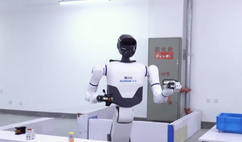
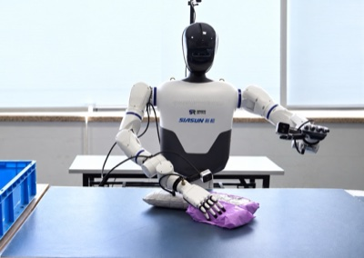
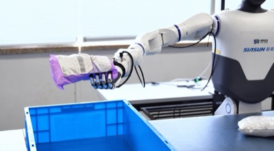

<h2 align="center">👋 Hi there! I'm Mingke</h2>

  

<!-- Ready to switch on — replace the placeholder and move the line up into the block above.

-->

Undergraduate student at Emory University studying Computational Mathematics and Computer Science. I currently work on multimodal ML algorithms, agentic systems and world model for solving complex scientific and engineering problems. Previous: AI/ML Engineer Intern@Ricoh USA, Robotics ML Intern@SIASUN Robotics.

  
  
  

